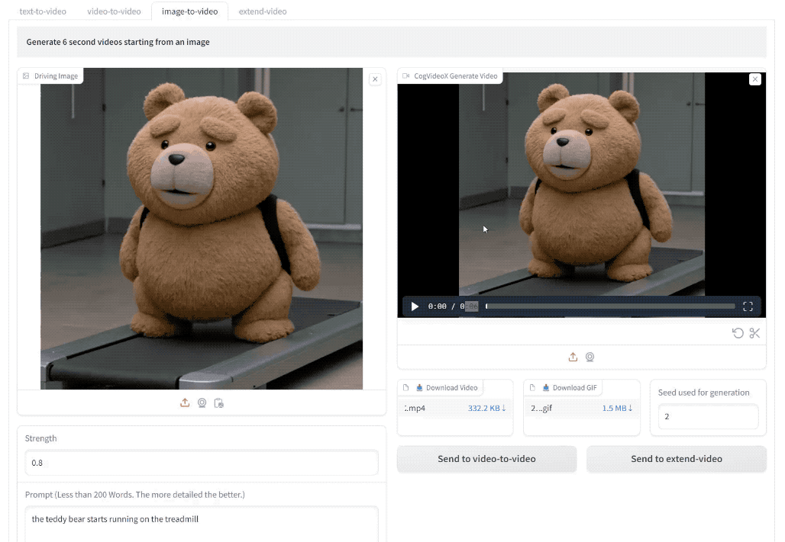
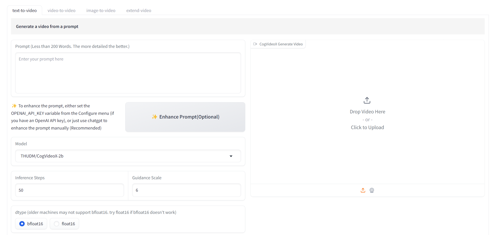
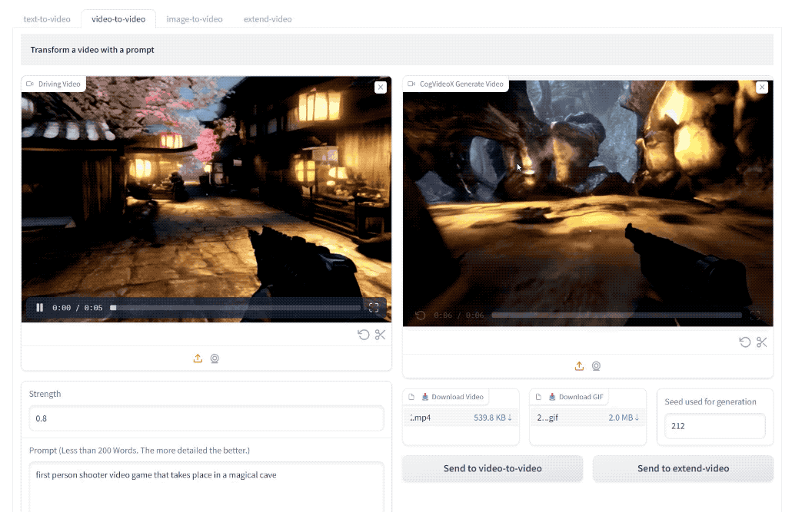
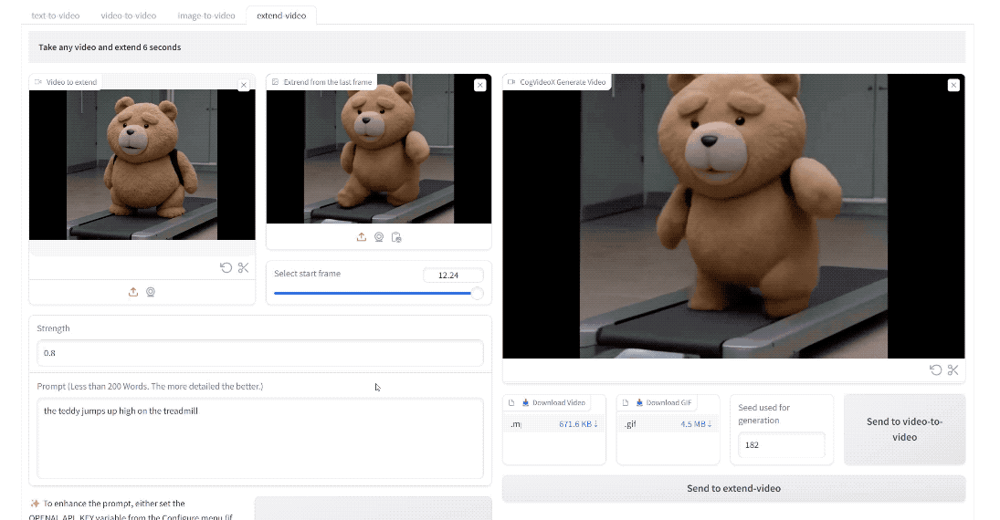
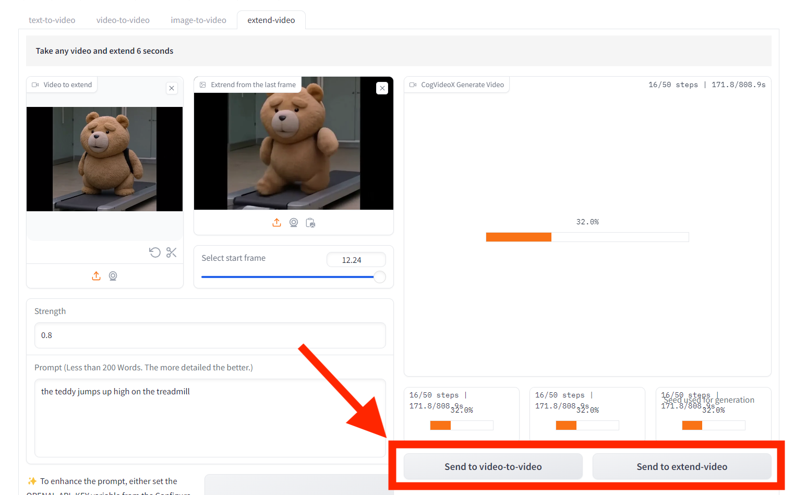

# Cogstudio

[NVIDIA Only] Advanced Web UI for CogVideo: https://github.com/THUDM/CogVideo



An advanced gradio web ui for generating and editing videos with CogVideo. Supports:

1. **Text-to-video:** Enter prompt to generate videos
2. **Video-to-video:** Video + Prompt => New video
3. **Image-to-video:** Generate a video from a start image
4. **Extend-video:** Take any video and extend it using the last frame
5. **Tab-based Workflow:** Generate videos and send them to **video-to-video** or **extend-video** with one click

# How it works

Cogstudio is a single file gradio application [cogstudio.py](cogstudio.py) that uses the latest version of CogVideo.

Because it's minimal and blends into the cogvideo repo (instead of existing as a fork), it should take advantage of all the future updates of CogVideo while using the advanced UI.


# Features

## 1. Text to Video

Enter prompt to generate videos



## 2. Video to Video

Upload a video and enter a prompt to transform the video into another video.



## 3. Image to Video

Upload a start image and a prompt, and generate a video from the image


## 4. Extend Video

Upload a video, select a frame to continue the video from, and generate an extended video.

> You can keep extending the generated video to infinity and generate a very long video this way.



## 5. Seamless Workflow

Once you generate a video, you can send it to:

1. video to video
2. extend video

tabs to add more editing, for example transforming the generated video, or taking the generated video and extending it to make it longer.



# Install

## 1. One Click Install

[Recommended] Use https://pinokio.computer to install this repo with one click.


## 2. Manual Install

First clone the Cogvideo repo:

```
git clone https://github.com/THUDM/CogVideo
```

Next copy the [cogstudio.py](cogstudio.py) under the `CogVideo/inference/gradio_composite_demo` folder.

Go into the CogVideo folder and create a venv:

```
cd CogVideo/inference/gradio_composite_demo
python -m venv env
```

Activate the venv.

If you're on Linux:

```
source env/bin/activate
```

Or if you're on Windows:

```
env\Scripts\activate
```

Install the CogVideo gradio dependencies into the venv

```
pip install -r requirements.txt
```

Install PyTorch for CUDA:

```
pip install torch==2.3.1 torchvision==0.18.1 torchaudio==2.3.1 --index-url https://download.pytorch.org/whl/cu121
```

One more thing you need to do is use the latest version of moviepy:

```
pip install moviepy==2.0.0.dev2
```

Now start the app:

```
python cogstudio.py
```

That's all!
